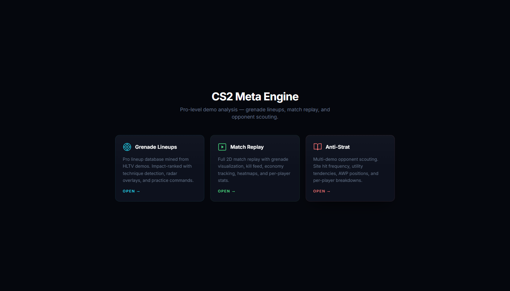
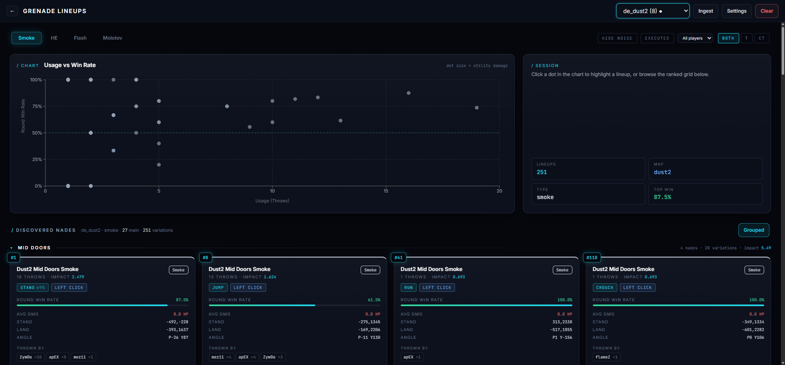
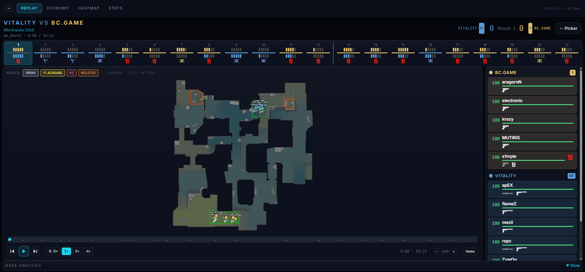
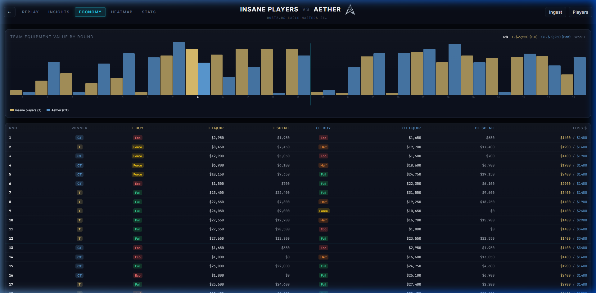
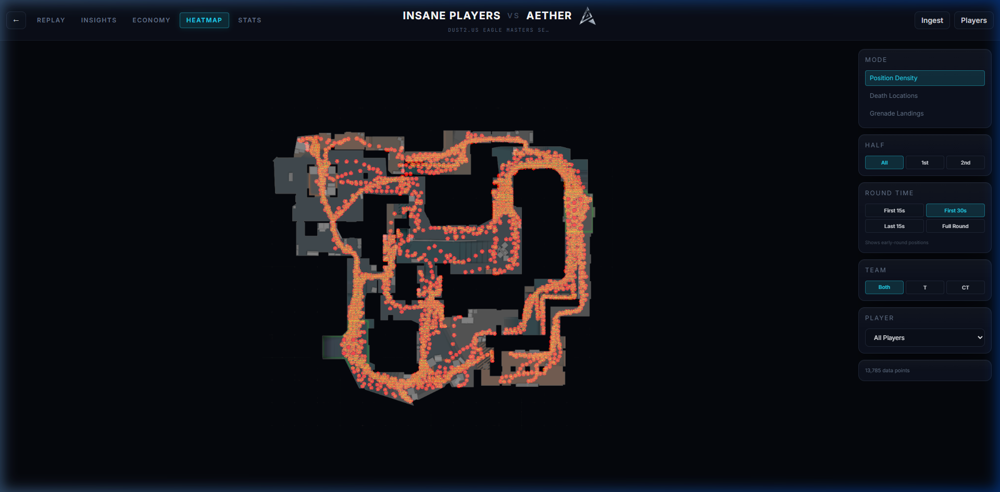
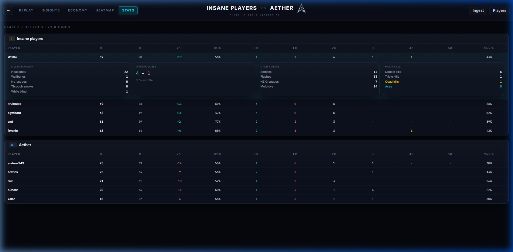
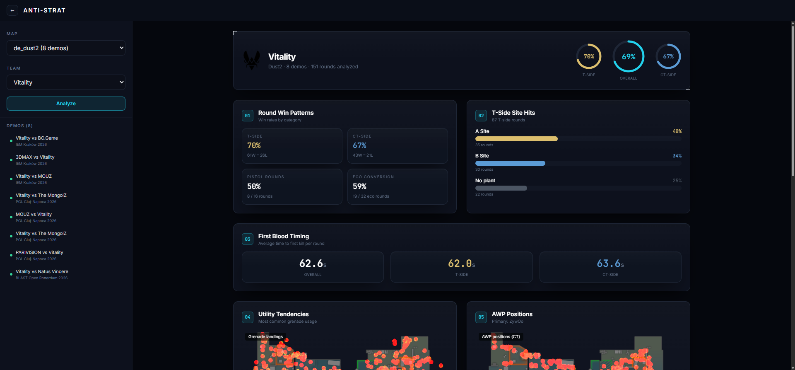
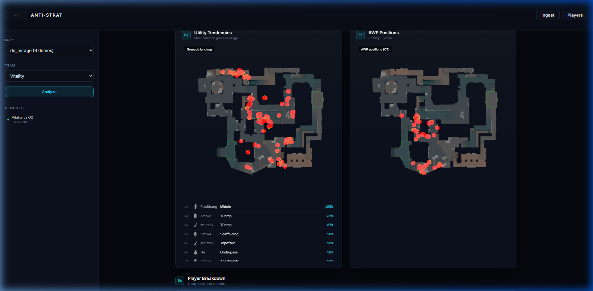
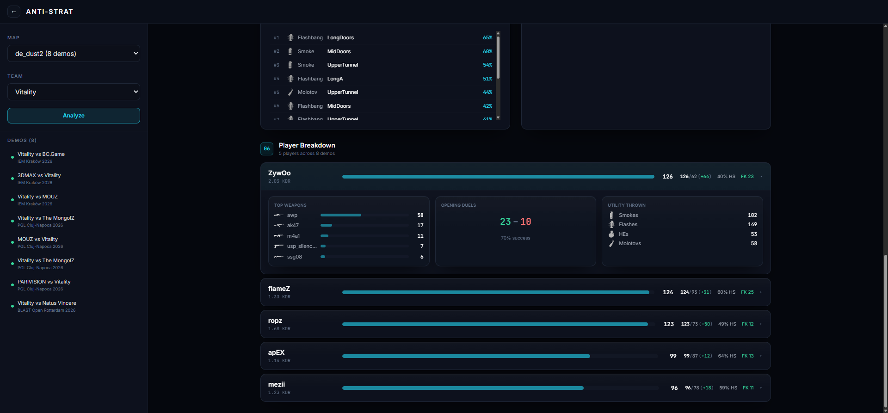
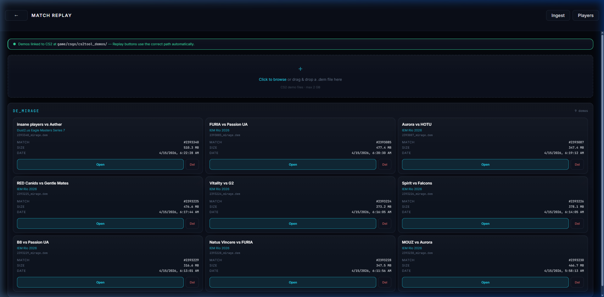

# CS2 Meta Engine

A pro-level CS2 demo analysis platform that no competitor matches. Mines demos from HLTV, extracts every grenade throw, clusters identical lineups, ranks them by impact, and serves them on a HUD-styled dashboard. Includes a full 2D match replay viewer, economy tracking, heatmaps, per-player stats, AI-powered insights, and **automated opponent scouting reports** — a feature neither Refrag nor SCL.gg offer.

### Landing Page


### Grenade Lineups — Impact-ranked pro lineups with scatter plot, radar overlay, and technique detection


### 2D Match Replay — Full match playback with player positions, grenade visualization, and kill feed


### Economy Tracker — Equipment value graph with buy type classification per round


### Heatmap — Position density, death locations, and grenade landing overlays


### Per-Player Stats — Scoreboard with K/D, HS%, first kills, and multi-kill rounds


### Anti-Strat Report — Round win patterns, site hit frequency, and first blood timing


### Anti-Strat — Utility tendency and AWP position heatmaps


### Anti-Strat — Per-player breakdown with weapons, utility usage, and opening duels


### Demo Picker — Upload or browse parsed demos, grouped by map


---

## Features

### Grenade Lineup Intelligence
- **Auto-discovery** — Parse pro demos, extract every grenade throw, bucket identical lineups by position + angle
- **Impact ranking** — `win_rate x log(throws) x (1 + avg_damage/100)` surfaces the highest-value lineups
- **Technique detection** — Stand, walk, run, crouch, jump, running-jump — recovered from velocity + duck state 8 ticks before the throw
- **Click classification** — Left / right / both — from the Source button bitmask
- **Callout labeling** — Auto-tags lineups with the nearest map callout (e.g. "B Window", "A Ramp")
- **Radar overlay** — 1024x1024 radar with throw-to-land lines, color-coded by grenade type, with callout labels and min-throws/win-rate sliders
- **Execute detection** — Identifies coordinated multi-grenade combos that pros throw together in the same round

### Anti-Strat Report (Opponent Scouting)
Feed the engine multiple demos of the team you're playing next week and get:
- **Site hit frequency** — "A site 65%, B site 20%, unknown 15%" with visual bars
- **Utility tendencies** — Radar heatmap of grenade landings + "Smoke long doors 92% of T rounds" frequency table with nade icons
- **AWP positions** — CT-side radar heatmap showing where they hold with the AWP, primary AWPer identified
- **First blood timing** — Average time to first kill per side (T-side / CT-side)
- **Round win patterns** — Win rate by side, pistol round win rate, eco conversion rate — displayed as SVG donut rings
- **Player breakdown** — Per-player K/D, HS%, KDR, opening duels, top weapons (with icons), utility usage (with nade icons), expandable detail cards
- **Multi-demo aggregation** — Loads all matching demos in parallel with progress bar, computes everything client-side
- **Team logos** — Scraped from HLTV match pages and displayed in the report header

### 2D Match Replay Viewer
- **Full match playback** — Player positions, yaw direction, health bars, weapon icons, armor indicators, centered player names
- **Grenade visualization** — Smoke clouds (20s), molotov patches (7s), flash bursts, HE shockwaves with countdown timers
- **Kill feed** — Real-time kill feed with headshot/wallbang/noscope/smoke/blind icons
- **Bomb events** — Plant/defuse indicators with site label and countdown timer
- **Custom scrubber** — HUD-styled playback slider with round tick markers, SVG transport buttons, elapsed/total time
- **Map zoom + pan** — Smooth 50%–200% zoom with click-and-drag panning when zoomed in
- **Round timeline** — Horizontal bar showing alive players per team, winner indicators, bomb/defuse/elimination icons
- **Stable player cards** — Fixed-height scoreboard cards that don't shift when players die
- **Timestamped notes** — Add bookmarks at any tick (stored in localStorage), shown as diamond markers on the scrubber
- **AI match recap** — Claude/OpenRouter-powered 3-5 paragraph narrative summary

### Economy Tracker
- **Equipment value graph** — Bar chart of T vs CT equipment value per round with hover details
- **Buy type classification** — Eco / Force / Half / Full buy badges based on team equipment thresholds
- **Round-by-round table** — Winner, buy types, equipment values, cash spent for both teams
- **Loss bonus tracking** — Consecutive loss bonus ($1400 base + $500/loss, max $3400)

### Heatmaps
- **Position density** — Where players spend time across rounds (gaussian blur + jet colormap)
- **Death locations** — Where players die most frequently
- **Grenade landings** — Where utility lands on the map
- **Filters** — Half (1st/2nd/all), team (T/CT/both), individual player

### Per-Player Stats
- **Scoreboard** — K / D / +/- / HS% / FK / FD / 2K-5K / Survival rate
- **Expandable detail cards** — Kill breakdown (headshot/wallbang/noscope/smoke/blind), opening duels, utility usage, multi-kill rounds
- **Computed client-side** — No backend changes needed, all derived from timeline data

### Practice Tools
- **Copy Console** — One-click `setpos/setang/give` string for any lineup
- **RCON teleport** — Send commands directly to a running CS2 instance
- **Demo replay** — `playdemo` + `demo_goto` commands to watch exact throws in-game
- **CS2 integration** — Auto-detect CS2 install, directory junctions for seamless replay

### Data Ingestion
- **HLTV scraping** — Filter by team, event, map; auto-download and extract demo archives
- **Team logos** — Scraped from HLTV match pages during ingestion, stored in roster sidecar files
- **Pipeline orchestration** — Parse, cluster, rank, and persist in one click
- **Status tracking** — Real-time progress for download, extraction, and analysis

### AI Features
- **Match recap** — Narrative summaries highlighting turning points and standout players
- **Lineup descriptions** — Natural language explanations of what each lineup does
- **Dual provider** — Claude (Anthropic) or OpenRouter (free tier)

---

## Quick Start

### Prerequisites
- Python 3.10+
- Node.js 18+
- WinRAR or 7-Zip on `PATH` (for HLTV demo archives)
- (Optional) CS2 with `-netconport 27015` for in-game practice

### Install
```bash
# Backend
pip install -r requirements.txt

# Frontend
cd frontend && npm install
```

### Configure
Create `.env` in the repo root:
```env
# AI features (pick one)
OPENROUTER_API_KEY=sk-or-...
OPENROUTER_MODEL=google/gemma-3-27b-it:free
# or
ANTHROPIC_API_KEY=sk-ant-...

# Optional
RCON_PASSWORD=changeme
DEMO_DIR=demos
CS2_GAME_DIR=C:/Program Files (x86)/Steam/.../game/csgo

# Cloud database (optional, defaults to local SQLite)
# DATABASE_URL=postgresql://...
```

### Run
```bash
# Terminal 1 — Backend
uvicorn backend.main:app --reload --port 8000

# Terminal 2 — Frontend
cd frontend && npm run dev
```

Open `http://localhost:5173`

---

## Navigation

| Route | Page | Description |
|-------|------|-------------|
| `/` | Landing Page | Hub linking to lineups, replay, and anti-strat |
| `/lineups` | Grenade Lineups | Lineup grid, scatter plot, ingest controls, execute combos |
| `/replay` | Demo Picker | Upload/browse demos, grouped by map |
| `/replay/:file` | Match Replay | 2D viewer with playback controls |
| `/replay/:file/economy` | Economy | Equipment graph + round-by-round buy analysis |
| `/replay/:file/heatmap` | Heatmap | Position/death/grenade density overlays |
| `/replay/:file/stats` | Stats | Per-player scoreboard + detailed breakdowns |
| `/anti-strat` | Anti-Strat | Multi-demo opponent tendency scouting report |

---

## Anti-Strat Report

The standout feature. Navigate to `/anti-strat` from the Dashboard header:

1. **Select a map** — dropdown populated from your demo library
2. **Select a team** — auto-discovered from HLTV roster data across all demos on that map
3. **Click Analyze** — loads all matching timelines in parallel
4. **Read the report** — site hit frequency, utility tendencies (with radar heatmap), AWP positions, first blood timing, round win patterns, and per-player breakdowns

All computation is client-side from existing timeline data. No new backend endpoints needed.

---

## API

| Method | Endpoint | Description |
|--------|----------|-------------|
| `GET` | `/api/lineups/{map}/{type}?limit=N` | Ranked lineups |
| `GET` | `/api/lineups/{map}?limit=N` | All grenade types for a map |
| `POST` | `/api/lineups/{id}/describe?map_name=` | AI lineup description |
| `GET` | `/api/maps` | Maps with analysed data |
| `GET` | `/api/demos` | Demos on disk, grouped by map |
| `GET` | `/api/callouts/{map}` | Callout positions |
| `GET` | `/api/radars/{map}` | Radar calibration data |
| `GET` | `/api/radars/{map}.png` | Radar PNG (1024x1024) |
| `GET` | `/api/executes/{map}` | Coordinated utility combos |
| `GET` | `/api/console/{id}?map_name=` | Console paste string |
| `GET` | `/api/replay/{id}?map_name=` | Playdemo + seek strings |
| `POST` | `/api/practice` | RCON teleport + give grenade |
| `POST` | `/api/ingest/hltv` | Queue HLTV scrape + pipeline |
| `POST` | `/api/ingest/run` | Re-run pipeline on existing demos |
| `GET` | `/api/ingest/status` | Poll pipeline progress |
| `GET` | `/api/match-replay/demos` | List demos for replay |
| `POST` | `/api/match-replay/upload` | Upload a .dem file |
| `DELETE` | `/api/match-replay/{file}` | Delete a demo |
| `GET` | `/api/match-replay/{file}/timeline` | Parse demo into timeline |
| `POST` | `/api/match-replay/{file}/insights` | AI match recap |
| `GET` | `/api/match-info/{file}` | Match metadata (teams, logos, event) |
| `GET` | `/api/settings/cs2-path` | CS2 path + link status |
| `POST` | `/api/settings/cs2-path` | Save CS2 directory |
| `POST` | `/api/demos/link-to-cs2` | Create directory junction |
| `DELETE` | `/api/demos/link-to-cs2` | Remove junction |
| `DELETE` | `/api/data` | Wipe lineup database |
| `GET` | `/api/stats` | Totals summary |

Interactive docs at `http://localhost:8000/docs`.

---

## How Lineups Work

Throws are bucketed along **six dimensions**:

| Dimension | Bucket size |
|-----------|-------------|
| Landing `(x, y)` | 50 units |
| Throw position `(x, y)` | 50 units |
| Yaw | 3 degrees |
| Pitch | 3 degrees |

A lineup is kept only if `throw_count >= 2` and `round_win_rate >= 0.5`.

Techniques are classified from velocity + duck state:
- `|vel_z| > 10` → jump
- `|vel_z| > 10 and horiz > 200` → running jump
- `ducking or duck_amount > 0.5` → crouch
- `is_walking` → walk
- `horiz > 200` → run
- Otherwise → stand

---

## Project Layout

```
cs2tool/
├── backend/
│   ├── main.py                FastAPI app — all endpoints
│   ├── config.py              Settings (env vars, paths)
│   ├── models/schemas.py      Pydantic models
│   ├── analysis/
│   │   ├── clustering.py      Bucket-based lineup dedup
│   │   ├── metrics.py         Pipeline orchestrator + SQLite
│   │   ├── executes.py        Execute combo detection
│   │   └── callouts.py        Map callout lookup
│   ├── ingestion/
│   │   ├── demo_parser.py     demoparser2 wrapper + timeline extraction
│   │   └── hltv_scraper.py    HLTV scraper + downloader + logo extraction
│   ├── rcon/bridge.py         RCON teleport bridge
│   └── data/
│       ├── radars/            Radar PNGs + calibration
│       ├── callouts/          Per-map callout JSON
│       └── lineup_data.db     SQLite database
├── frontend/src/
│   ├── api/client.ts          Typed API client (axios)
│   ├── App.tsx                React Router routes
│   └── components/
│       ├── Dashboard.tsx       Lineup grid + filters + nav
│       ├── AntiStratPage.tsx   Opponent scouting report (multi-demo)
│       ├── ReplayLayout.tsx    Replay tab nav + shared data loading
│       ├── MatchReplayViewer.tsx  2D match replay (SVG + rAF)
│       ├── EconomyPanel.tsx    Economy tracker (graph + table)
│       ├── HeatmapPanel.tsx    Heatmaps (canvas overlay)
│       ├── StatsPanel.tsx      Per-player stats scoreboard
│       ├── DemoPickerPage.tsx  Demo upload/browse
│       ├── LineupCard.tsx      Individual lineup card
│       ├── RadarView.tsx       Radar overlay modal
│       ├── ScatterPlot.tsx     Win rate vs usage scatter
│       ├── IngestPanel.tsx     HLTV ingest controls
│       └── SettingsPanel.tsx   CS2 path + demo linking
├── demos/                     .dem files (gitignored)
├── data/                      SQLite DB + timeline cache (gitignored)
└── requirements.txt
```

---

## Stack

- **Backend**: FastAPI + demoparser2 (Rust) + SQLite + Anthropic SDK
- **Frontend**: React 18 + Vite + Tailwind CSS + React Router + Recharts
- **AI**: Claude (Anthropic) or OpenRouter (free tier)
- **Parser**: demoparser2 — Rust-backed, extracts tick-level player data + events

## Credits

- **demoparser2** — Rust-based CS2 demo parser (LaihoE)
- **awpy** — radar assets + calibration data
- **CS2Callouts** — callout origin extraction
- **HLTV.org** — match + demo sourcing + team logos
- **OpenRouter** — free AI model access

---

Research/educational project. Use on demos you have the right to analyse. Respect HLTV's rate limits.
