# CS2 Meta Engine

A CS2 demo-analysis platform for players, coaches and analysts. It ingests pro, FACEIT and your own matchmaking demos, extracts every grenade throw, clusters identical lineups and ranks them by impact. It also gives you:
- a full 2D match replay
- HLTV 2.0-style player ratings
- automated opponent scouting reports
- practice configs you can load in-game
- a live radar fed by CS2 itself

It runs locally, or self-hosted on Kubernetes with Postgres, a job worker, CI/CD, monitoring and infrastructure as code.

**Highlights**
- **Lineups** mined from real demos: impact-ranked, with stand/run/jump technique and left/right click detection, executes, and *your throw vs the pro lineup* ("12u left, 3° too high")
- **2D replay**: smooth playback with key moments (entries, clutches, multi-kills, eco wins) and shareable links to any round and second
- **Anti-strat**: site hits, utility, AWP spots, CT setups and T defaults at 0:20, with a shareable link and PDF
- **Player profiles**: Rating 2.0, ADR, KAST, clutches (1v1–1v5), trade %
- **Practice lists**: star lineups, then export a `.cfg` that cycles through them in CS2 with `]` / `[`
- **Live radar**: CS2 Game State Integration, including upper and lower levels on Nuke and Vertigo
- **Imports**:
  - your matchmaking demos, picked up automatically
  - FACEIT demos via the official API
  - HLTV demos via a one-click browser extension
  - archives (`.rar`, `.zip`, `.dem.gz` / `.bz2` / `.zst`)
- **Phone-friendly**: every page works at 375px

---

## Screenshots

### Home
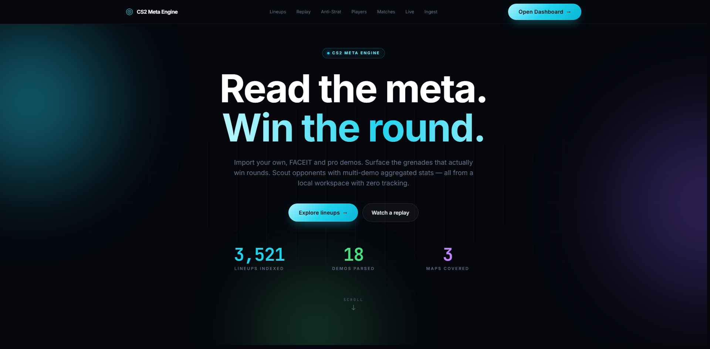

### Grenade lineups: impact-ranked pro lineups with scatter plot and technique detection
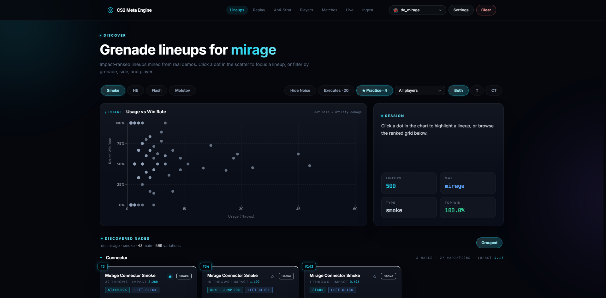

### Demo picker: upload or browse demos grouped by map
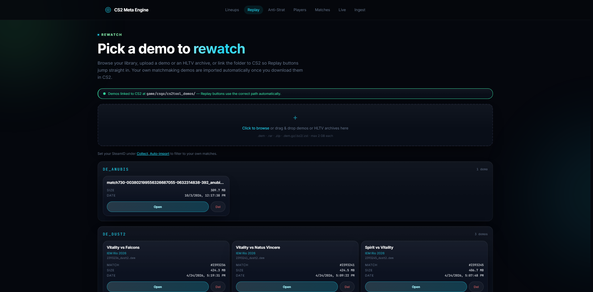

### Match replay: live 2D viewer with team header, score and bomb timer


### Insights: round overlay with utility paths, entry/exit markers, flash blinds and AOE radii
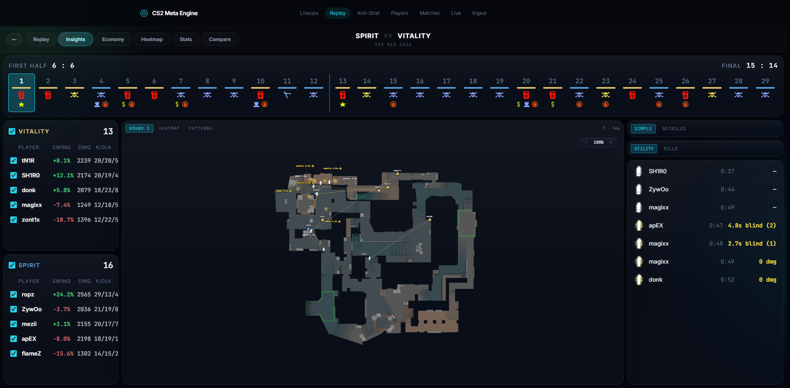

### Insights · Patterns: one player across every round, or drill into a single round
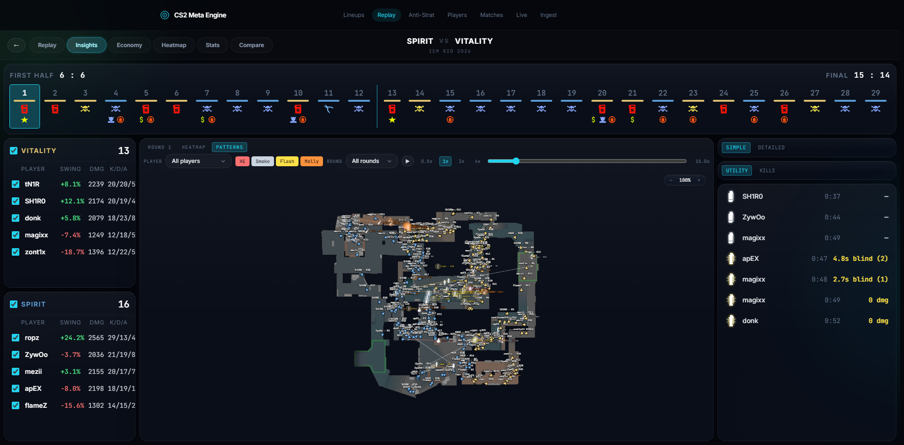

### Insights · Heatmap: grenade landings across the match
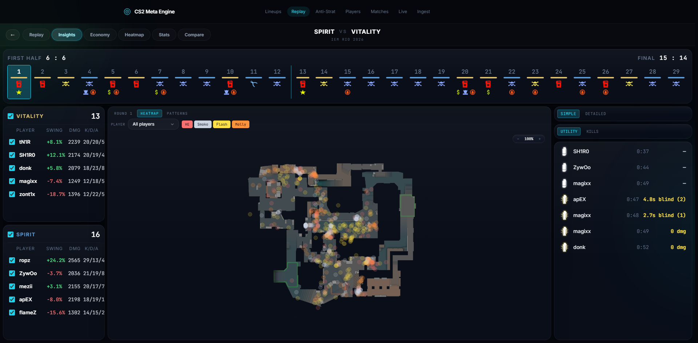

### Economy: equipment value and buy types round by round


### Heatmap: positions, deaths and utility
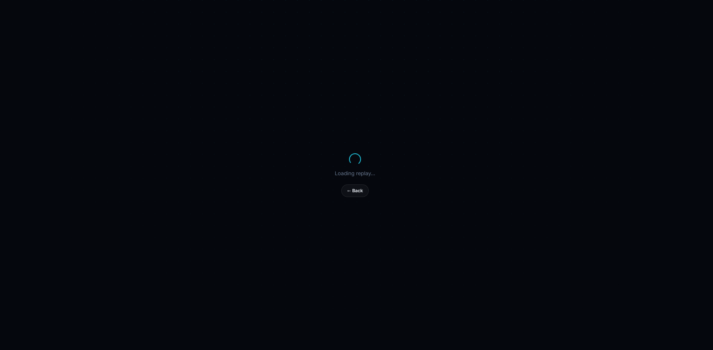

### Stats: per-player scoreboard
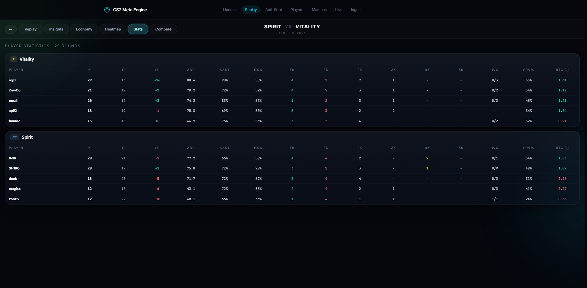

### Anti-strat: scouting report for an opponent
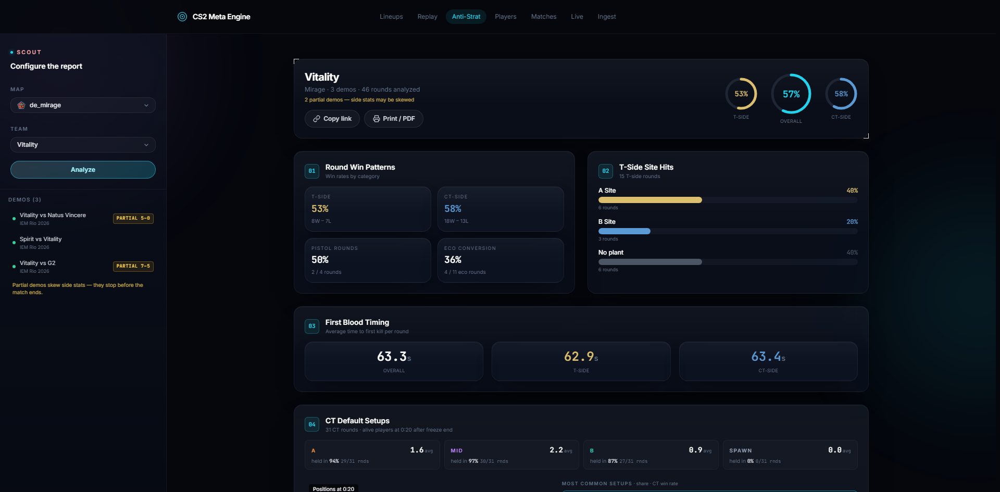
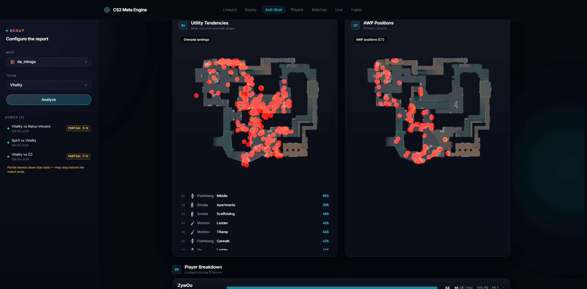
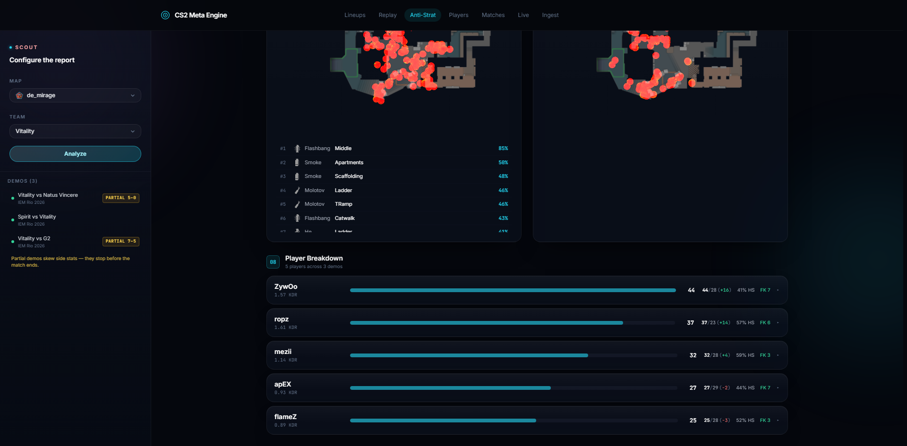

### Players: cross-demo leaderboard and profiles
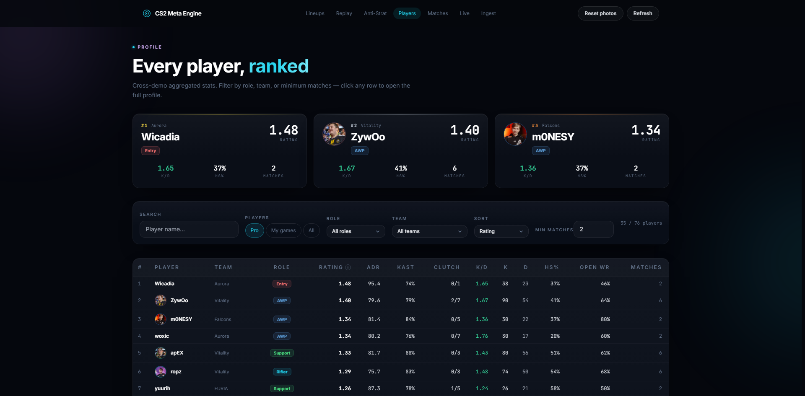
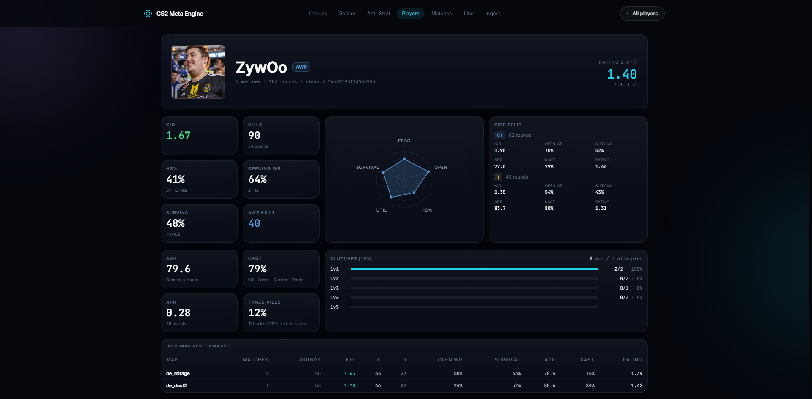

---

## Features

### Getting demos in
HLTV blocks automated server-side requests (Cloudflare). The app never tries to get around that; every source below is user-initiated or an official API.

| Source | How |
|---|---|
| **Your matchmaking games** | The folder watcher picks up demos from CS2's `replays` folder as soon as you click Download in CS2's Watch tab, renames them by map and parses them. "My matches" in the demo picker filters to games you played in (set your SteamID in Ingest → Auto-import). |
| **FACEIT** | Paste a FACEIT profile URL, pick a match, and the demo downloads through FACEIT's official Data + Downloads APIs (`FACEIT_API_KEY`). |
| **HLTV (browser extension)** | The [Chrome extension](extension/README.md) adds **Send to CS2 Meta Engine** to HLTV match pages. Your own browser downloads the demo; the app imports the archive and writes the roster (teams, players, logos) from the page you sent. |
| **Upload / drop folder** | Drag a `.dem`, `.rar`, `.zip`, `.dem.gz`, `.dem.bz2` or `.dem.zst` onto the demo picker, or drop it in `data/inbox`. |

Every import:
- is de-duplicated
- is named `<match>_<map>.dem` from the demo header
- has multi-part HLTV archives handled (the largest part is kept)
- is parsed into a replay timeline and player stats straight away

### Match catalog (Liquipedia)
- Recent and upcoming pro matches from the [Liquipedia](https://liquipedia.net) API: teams, scores, tier (S/A/B…), maps and links to HLTV and Liquipedia.
- Demos already on disk are matched to their catalog row.
- The client follows Liquipedia's [API terms](https://liquipedia.net/api-terms-of-use):
  - an identifying User-Agent
  - gzip
  - throttling: 1 request per 2 s, and 1 page parse per 30 s
  - disk caching
  - CC-BY-SA attribution
- Refreshes run as background jobs (every 2 h on the cluster).

### Grenade lineup intelligence
- **Auto-discovery:** every throw from every demo, bucketed by throw position (75u), stand position and angle (6°).
- **Current CS2 demos:** the game no longer emits `grenade_thrown`. Throws are rebuilt from the grenade's flight path, and this matches the real event exactly on all 5,003 throws in the reference pro demos.
- **Impact ranking:** `round_win_rate × log1p(throws) × (1 + avg_utility_damage/100)`.
- **Technique + click:** stand / walk / run / crouch / jump / running-jump, and left / right / both. Taken from velocity, stance, buttons and throw strength.
- **Callouts:** each lineup is labelled with the nearest map callout, e.g. "Mirage Top of Mid Smoke".
- **Executes:** recurring 3–4-grenade cores thrown together within 10 s, with win rates.
- **Practice:**
  - copy the `setpos` / `setang` / `give` console string
  - teleport via RCON
  - jump to the exact throw in the demo with `playdemo`
- **Practice lists:** star lineups into per-map lists, reorder and annotate them, then download or install `practice_<list>.cfg`. In CS2, `exec practice_<list>` loads it, and `]` / `[` cycle through the lineups.

### 2D match replay
- **Playback:** positions, view direction, health, armor, weapons, smokes, molotovs, flashes, HEs and bomb timers. You can zoom and pan with the mouse or by touch.
- **Kill feed** and a **round timeline** showing alive counts, winners and how each round ended.
- **Key moments:** entries, multi-kills, clutches (won or lost), plants, defuses and eco wins. Click one to jump there; each has a link.
- **Shareable links:** `/replay/<demo>?round=14&t=45` opens paused at that moment.
- **Partial-demo detection:** demos that end before the match did (HLTV split demos) are flagged everywhere. Restarted or replayed rounds are dropped, and the final score comes from the game's own scoreboard.
- **Notes**, bookmarks, and an **AI recap** (Claude, or OpenRouter as a free fallback).

### Compare: your throws vs the pro lineup
A replay tab that matches each of a player's throws to the nearest pro lineup on the same map. It shows:
- where you stood and aimed, relative to the pro's facing ("12u left, 3° too high, landed 40u short")
- a radar overlay of both throws
- an on-point / close / off badge

### Insights, Economy, Heatmap, Stats
- **Insights:** round mode, patterns mode and heatmap mode for utility.
- **Economy:** equipment-value chart and buy types (Pistol / Eco / Force / Half / Full), with loss-bonus tracking.
- **Heatmaps:** position density, deaths and utility landings, with half/team/player filters.
- **Stats:**
  - K / D / ±, HS %, opening kills, multi-kills
  - ADR, KAST and 1vX clutches
  - trade breakdown

### Player profiles
- **Rating 2.0** (the community approximation of HLTV's formula), falling back to Rating 1.0 for old demos without damage counters.
- **ADR, KAST %, APR**, trade-kill % and traded-death %, and **clutches 1v1–1v5** (won/attempted).
- **Role inference** (AWP / Entry / Support / Lurker / Rifler), with per-map and per-side splits and match history.
- **Player photos:** only openly licensed images from Liquipedia are used, with attribution. They refresh in the background after 14 days, and a failed or blocked fetch never removes a photo you already have.

### Anti-strat report (opponent scouting)
Pick a map and a team, and every demo of theirs is analysed together:
- **Default setups:** CT setups and the T default spread at 0:20, as callouts and A / Mid / B zones, with win rates and a radar.
- **Site hits, utility tendencies and AWP positions**, as radar heatmaps.
- **First-blood timing** and **round win patterns** (sides, pistols, eco conversion).
- **Per-player breakdown:** weapons, utility and opening duels.
- **Sharing:** `/anti-strat?map=de_mirage&team=G2` runs automatically, and **Print / PDF** gives a clean report.

### Live radar (Game State Integration)
- **Setup:** one click installs `gamestate_integration_cs2metaengine.cfg` into CS2. After restarting CS2, open `/live`.
- **Spectating, GOTV or watching a demo:** all 10 players appear with facing arrows, HP, money, weapons and utility. You also get the bomb, smokes and fires in-flight, a scoreboard and the phase timer. Nuke and Vertigo show **upper and lower radars side by side**.
- **While you're playing:** CS2 only sends your own data. This is Valve's anti-cheat design; no setting changes it.

### Mobile
Every page works on phones and tablets: a menu button below 1024px, stacked panels, tables that scroll inside their panel, and touch-friendly controls.

---

## Quick start

### Prerequisites
- Python 3.12, Node.js 20+
- WinRAR / UnRAR or 7-Zip on `PATH`, for `.rar` archives
- Optional: CS2, for practice configs, RCON and the live radar

### Install and run
```bash
pip install -r requirements.txt
cd frontend && npm install && cd ..

# Terminal 1
uvicorn backend.main:app --reload --reload-dir backend --port 8000
# Terminal 2
cd frontend && npm run dev
```
Open http://localhost:5173. On Windows, `install.bat`, `run_backend.bat` and `run_frontend.bat` do the same.

With the default `PROCESS_ROLE=all`, the API process also runs the job worker and the folder watcher, so this is all you need locally.

### Configure (`.env`)
Copy `.env.example` to `.env`. Everything is optional:

| Variable | Purpose |
|---|---|
| `FACEIT_API_KEY` | FACEIT match lists and demo downloads ([developers.faceit.com](https://developers.faceit.com)) |
| `ANTHROPIC_API_KEY` / `OPENROUTER_API_KEY` | AI match recaps and lineup descriptions (default model `claude-opus-5-5`) |
| `ADMIN_TOKEN` | Required `X-Admin-Token` for deletes, uploads, imports and settings. The browser prompts once. Leave empty on a private machine. |
| `DATABASE_URL` | `postgresql://…` to use Postgres; empty = SQLite at `DB_PATH` |
| `PROCESS_ROLE` | `all` (default) · `api` (enqueue only, scale-out) · `worker` (`python -m backend.worker`) |
| `DEMO_DIR`, `DB_PATH` | Where demos and the SQLite DB live (default `demos/`, `data/lineups.db`) |
| `RCON_HOST/PORT/PASSWORD` | In-game teleport practice (launch CS2 with `-netconport 27015`) |
| `LIQUIPEDIA_CONTACT` | Contact string in the Liquipedia User-Agent (defaults to this repo's URL) |

### Docker
```bash
cp .env.example .env
docker compose up -d --build     # http://localhost (WEB_PORT to change)
```
This runs nginx (static frontend plus the `/api` proxy) and the FastAPI backend as a non-root user, with a pinned dependency lock (`requirements.lock`).

---

## Architecture

```
            ┌──────────────── browser (React + Vite) ────────────────┐
            │  pages · mobile nav · admin-token prompt · SSE radar   │
            └───────────────┬────────────────────────────────────────┘
                            │ /api (gzip)
   CS2 (GSI) ──POST──▶ ┌────┴────────────────┐   enqueue    ┌──────────────────────┐
   extension ──POST──▶ │ FastAPI  (role=api) │ ───────────▶ │  jobs table          │
                       │  × N replicas       │ ◀─ status ── │  (Postgres / SQLite) │
                       └────┬────────────────┘              └──────────┬───────────┘
                            │ reads                                    │ claim (SKIP LOCKED)
                            ▼                                          ▼
                 ┌─────────────────────┐                  ┌──────────────────────────┐
                 │ Postgres            │ ◀──── writes ─── │ worker (role=worker) × 1 │
                 │ lineups · players · │                  │ ingest · pipeline ·      │
                 │ catalog · jobs …    │                  │ catalog · photo warm ·   │
                 └─────────────────────┘                  │ folder watcher           │
                                                          └──────────────────────────┘
        shared volumes: demos/ · data/timelines (parsed replay cache) · player photos
```

- **Job queue** (`backend/jobs.py`): long work (ingest, the lineup pipeline, catalog refresh, photo warm-up) is a row in `jobs`.
  - Workers claim atomically (`FOR UPDATE SKIP LOCKED`), and jobs in a group run one at a time.
  - Progress and heartbeats live in the row, so any API replica reports the same status. Stale jobs are reaped.
- **Database layer** (`backend/db.py`): one `connect()` for SQLite or Postgres. It translates placeholders, identity columns, `INSERT OR IGNORE`, scalar `MAX`/`MIN` and `datetime('now')`, and tolerates concurrent `CREATE … IF NOT EXISTS`.
- **Migration:** `python -m backend.migrate_sqlite` copies a SQLite DB into Postgres. The worker does this automatically, once, against an empty Postgres.
- **Live radar across replicas:** the latest GSI state is mirrored to a one-row table, so CS2 can post to one pod while browsers read from another.

---

## Deployment (self-hosted)

Everything for the production deployment on a Proxmox box is in the repo:

| Path | What |
|---|---|
| [`terraform/`](terraform/README.md) | The VM, via the Proxmox API (bpg provider) |
| [`terraform/cloudflare/`](terraform/cloudflare/README.md) | Public HTTPS via **Cloudflare Tunnel** plus a **Cloudflare Access** login (email one-time PIN), with no open ports |
| [`ansible/`](ansible/README.md) | OS → Docker → registry → k3s → CI runner → app secrets (admin token, Postgres credentials) → optional `cloudflared`, idempotent |
| [`k8s/`](k8s/README.md) | Postgres StatefulSet, API ×2 (rolling), worker ×1, web, ingress, CronJobs (catalog refresh, nightly `pg_dump`), Prometheus + Grafana dashboards and alerts |
| [`.github/workflows/deploy.yml`](.github/workflows/deploy.yml) | CI/CD (below) |

### CI/CD
Every push and PR runs on GitHub-hosted runners:
- `pytest` + ruff on SQLite
- the **same suite against a Postgres 16 service**
- frontend type-check and build
- `terraform validate` for both Terraform roots
- Playwright end-to-end tests at phone and desktop sizes

Pushes to `main` then build both images on the self-hosted runner, push them to the cluster's registry, generate database credentials if missing, roll out Postgres, the API, the worker and the web, and smoke-test.

### Backups
- **Database:** a nightly `pg_dump` at 03:30 into the `backups` volume, keeping 14.
  Restore with `gunzip -c cs2-<stamp>.sql.gz | kubectl -n cs2 exec -i postgres-0 -- psql -U cs2 cs2`.
- **Whole VM:** demos, timelines and photos can be re-derived, so a VM-level backup covers them. Schedule it once on the Proxmox host:
  ```bash
  pvesh create /cluster/backup --id cs2-weekly --schedule 'sun 04:00' --vmid 101 --storage local --mode snapshot --compress zstd --prune-backups keep-last=4
  ```

### Admin token
When `ADMIN_TOKEN` is set, destructive and filesystem-writing endpoints need an `X-Admin-Token` header; the web UI asks once and remembers it. On the cluster, Ansible generates the token and writes a copy to `~debian/cs2-admin-token.txt`.

---

## Tests

```bash
pip install -r requirements-dev.txt
pytest                                    # backend suite on SQLite
TEST_DATABASE_URL=postgresql://… pytest   # same suite on Postgres
ruff check backend tests --select E9,F63,F7,F82,F401
cd frontend && npx tsc --noEmit           # type-check
cd frontend && npm run e2e                # Playwright, phone + desktop
```

No local Postgres? `pip install pgserver` gives you a throwaway one:
```python
import pgserver, tempfile; print(pgserver.get_server(tempfile.mkdtemp()).get_uri())
```

---

## Pages

| Route | Page |
|---|---|
| `/` | Home |
| `/lineups` | Lineup grid, scatter plot, executes, practice lists |
| `/replay` | Demo picker: upload (including archives), My matches, partial-demo badges |
| `/replay/:demo` | 2D replay, key moments, share links (`?round=&t=`) |
| `/replay/:demo/insights` · `/economy` · `/heatmap` · `/stats` · `/compare` | Replay tabs |
| `/anti-strat` | Scouting report (`?map=&team=` to share) |
| `/players`, `/players/:steamid` | Leaderboard and profiles |
| `/matches` | Liquipedia match catalog |
| `/ingest` | HLTV · FACEIT · Auto-import · Browser extension |
| `/live` | Live GSI radar |

## API

There are 77 endpoints; interactive docs are at **http://localhost:8000/docs**. The main groups:

| Area | Endpoints |
|---|---|
| Lineups | `GET /api/lineups/{map}/{type}`, `GET /api/maps`, `GET /api/executes/{map}`, `GET /api/console/{id}`, `GET /api/replay/{id}`, `POST /api/practice`, `POST /api/lineups/{id}/describe` |
| Replay | `GET /api/match-replay/demos`, `GET /api/match-replay/{demo}/timeline` (gzip, cached), `GET …/meta` (completeness), `POST …/insights`, `GET /api/match-info/{demo}` |
| Ingest and jobs | `POST /api/ingest/run`, `POST /api/ingest/faceit/matches`, `POST /api/ingest/faceit/download`, `GET /api/ingest/status` |
| Imports | `GET/PUT /api/import/settings`, `GET /api/import/status`, `POST /api/import/scan`, `POST /api/import/upload`, `POST /api/import/hltv-page`, `POST /api/import/hltv-download` |
| Players | `GET /api/players`, `GET /api/players/{steamid}`, `GET /api/players/match/{demo}`, `POST /api/players/refresh` |
| Compare | `GET /api/compare/{demo}?steamid=` |
| Practice lists | `GET/POST /api/practice-lists`, items, order, `GET …/{id}/cfg`, `POST …/{id}/install` |
| Catalog | `GET /api/catalog/matches`, `GET /api/catalog/events`, `GET /api/catalog/status`, `POST /api/catalog/refresh` |
| Photos | `GET /api/player-photo/{hltv_id}.png`, `GET /api/player-photo/by-name/{name}.png`, `GET …/attribution`, `POST /api/player-photos/warm` |
| Live radar | `POST /api/gsi`, `GET /api/gsi/state`, `GET /api/gsi/stream` (SSE), `GET /api/gsi/config`, `POST /api/gsi/install`, `GET /api/gsi/status` |
| Radar assets | `GET /api/radars/{map}` (calibration, plus lower level on Nuke and Vertigo), `GET /api/radars/{map}.png`, `GET /api/callouts/{map}` |

---

## Project layout

```
backend/
  main.py               app wiring + core endpoints (lineups, replay, ingest, FACEIT, settings)
  db.py                 SQLite / Postgres connection layer
  jobs.py · worker.py   job queue + worker process
  migrate_sqlite.py     SQLite → Postgres copier
  api/                  routers: catalog, photos, players, imports, compare, practice_lists, gsi, deps
  analysis/             clustering, metrics (pipeline), executes, callouts, player_stats,
                        validation (completeness), compare
  ingestion/            demo_parser, importer, faceit_scraper, liquipedia, match_catalog, hltv_scraper
  rcon/bridge.py        RCON teleport
  data/                 radars (+ lower levels), callouts
extension/              Chrome MV3 "Send to CS2 Meta Engine"
frontend/src/
  api/                  typed clients (client.ts + per-feature modules)
  components/           pages and panels (live/, antistrat/ subfolders)
  lib/                  economy + key-moment helpers
frontend/e2e/           Playwright tests
tests/                  pytest suite (+ fixtures)
k8s/ · ansible/ · terraform/ · docker/   deployment
```

## Credits and data sources
- **[demoparser2](https://github.com/LaihoE/demoparser)**: Rust CS2 demo parser
- **[awpy](https://github.com/pnxenopoulos/awpy)**: radar images and calibration
- **[Liquipedia](https://liquipedia.net)**: match catalog and openly licensed player photos (CC-BY-SA; see the attribution in the app)
- **[FACEIT](https://developers.faceit.com)**: Data and Downloads APIs
- **HLTV.org**: match pages and demos, via your own browser and the extension
- **Valve**: CS2 Game State Integration

---

Research and educational project. Analyse demos you have the right to use, and respect each data source's terms and rate limits.
